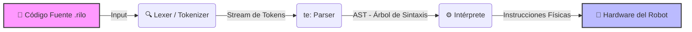

# 🤖 RILO (Robot Instruction Language & Operations)


> **Un Lenguaje de Dominio Específico (DSL) para la abstracción lógica de movimiento robótico.**

---

## Descripción del Proyecto

**RILO** no es solo un script de control; es un lenguaje de programación interpretado diseñado para desacoplar la lógica de movimiento de la complejidad del hardware.

El objetivo principal es permitir la elaboración de instrucciones precisas para administrar un robot **sin necesidad de gestionar drivers, pines GPIO o protocolos de bajo nivel**. El usuario escribe la *intención* (lógica de movimiento) y el intérprete de RILO se encarga de la *ejecución* (control de motores y sensores).

### Características Principales
* **Sintaxis Natural:** Comandos legibles en inglés (`move`, `turn`, `start`).
* **Abstracción de Hardware:** El usuario no necesita saber C++ o Arduino, solo la lógica de navegación.
* **Arquitectura Modular:** Separación clara entre el análisis léxico (Lexer), sintáctico (Parser) y la ejecución.

---

## Arquitectura del Compilador

El flujo de procesamiento de RILO sigue el estándar de diseño de compiladores modernos:



---

## Ejemplo de Uso
Un script típico de RILO para que el robot avance, gire y emita un sonido se ve así:

```
    start()
    move forward 100
    turn right
    run 50
    sound "Objetivo alcanzado"
    stop()
```

---

## Cómo ejecutar

* Clona el repositorio: `git clone [https://github.com/Codedharr/Rilo.git](https://github.com/Codedharr/Rilo.git)`
* Ejecuta con: `python main.py`

---

## Créditos y Contexto Académico

Este proyecto fue diseñado e implementado como parte de la carrera de Ingeniería en Computación.

* Autor: Daniel Rendon (@Codedharr)
* Institución: Universidad Valle del Momboy
* Tutoría: Ing. Katiuska Morillo

---

Hecho con lógica y café ☕.


